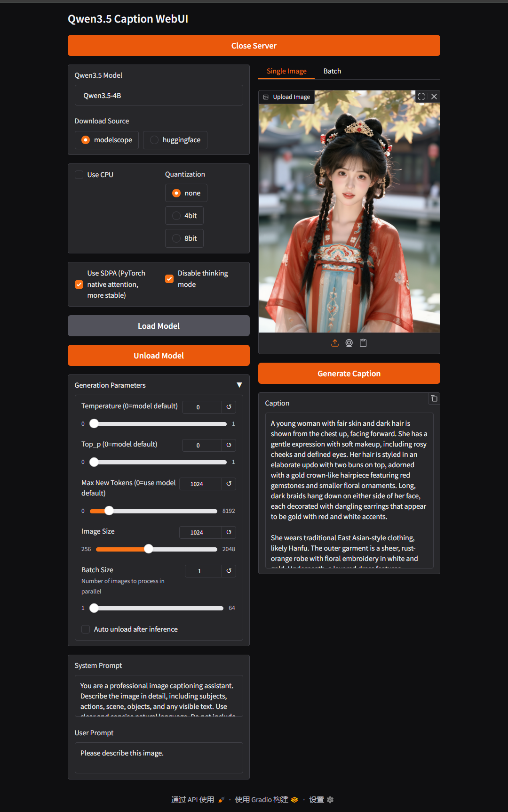

# Qwen3.5-Caption-WebUI

一个基于 Qwen3.5 系列视觉语言模型的图像描述生成工具，提供简洁的命令行和 WebUI 界面。

代码使用AI生成，成功运行。

充电支持：[B站：赛博画师GZT](https://space.bilibili.com/702745384)

## 特性

- 支持 Qwen3.5-2B/4B/9B/27B/35B-A3B 等模型
- 提供 Gradio WebUI 界面
- 支持单张图片和批量处理
- 自动从 Hugging Face 或 ModelScope 下载模型
- 可禁用模型的思考模式 直接输出纯净描述
- 支持4bit/8bit 量化

## 安装

git clone https://github.com/GZT2023/Qwen3.5-Caption-WebUI.git

cd Qwen3.5-Caption-WebUI

python -m venv --copies venv

.\venv\Scripts\activate

python -m pip install --upgrade pip

pip install torch==2.10.0+cu130 torchvision==0.25.0+cu130 --index-url https://download.pytorch.org/whl/cu130

pip install -r requirements.txt

 
## 运行
激活虚拟环境

.\venv\Scripts\activate

.\venv\Scripts\python.exe -s gui.py --inbrowser

或直接运行 启动.bat

## 使用说明

WebUI 界面说明

界面分为左右两栏：

左侧：模型配置与生成参数

Qwen3.5 Model：选择模型（2B/4B/9B/27B/35B-A3B）

Download Source：下载源，默认 modelscope（国内快），可选 huggingface

Quantization：量化选项（none/4bit/8bit）

Use SDPA (PyTorch native attention, more stable)：启用 SDPA加速 

Disable thinking mode：去除输出中的 <think>...</think> 思考内容

Generation Parameters：生成参数（0 表示使用模型默认值）

Temperature：采样温度

Top_p：核采样概率阈值

Max New Tokens：最大生成长度（默认 1024，上限 8192）

Image Size：输入图像缩放尺寸（默认 1024）

Batch Size：批量处理时的并行数

Auto unload after inference：推理后自动卸载模型释放显存

System Prompt / User Prompt：自定义提示词

先设置好参数，再加载模型，同理切换模型先卸载模型，再加载模型。

右侧：图片输入与结果

Single Image 标签：上传单张图片，点击生成

Batch 标签：指定输入目录、递归选项、自定义保存目录等，点击开始批量处理

## 项目结构

Qwen3.5-Caption-WebUI/

├── caption.py          # 命令行入口，包含模型类和标注逻辑

├── gui.py              # Gradio 图形界面

├── utils.py            # 工具函数（日志、图像处理、ModelScope下载）

├── configs/

   │   └── default_qwen_vl.json   # 模型名称到ID的映射

├── models/             # 模型缓存目录（自动创建）

├── requirements.txt    # 依赖列表

└── README.md           # 本文档

## 注意事项

模型首次加载会自动下载，请确保网络通畅。国内用户推荐使用 modelscope 源（默认），速度更快。模型自动下载到models\modelscope 

量化（4bit/8bit）需安装 bitsandbytes，并可能降低生成质量，但可大幅减少显存占用。

批量处理时，请根据显存大小调节 batch_size，过大可能导致 OOM。

如果生成遇到乱码，请适当增加 max_new_tokens（默认 1024 已足够)。

本项目仅支持 Qwen3.5 系列 视觉语言模型，不兼容其他架构。

## 批量反推提示词
示例：

选择模型 Qwen3.5-4B

设置 Batch Size = 4

在 Batch 标签页填写图片目录，如 D:\photos

点击 Start Batch，程序将自动遍历图片并生成字幕文件（与图片同名，扩展名 .txt）

## ⚖️ 免责声明

本软件仅供学习、研究和教育目的使用。开发者不鼓励、不支持也不授权将本项目用于任何违反当地法律法规或道德伦理的活动。

模型输出内容：Qwen3.5 系列模型如果生成包含偏见、不当或冒犯性内容的文本。使用者应自行对模型输出进行审查和过滤，并承担由此产生的一切责任。

使用风险：使用者明确承认并同意，自行承担使用本软件的全部风险。对于因使用本软件导致的任何直接或间接损失（包括但不限于数据丢失、系统损坏、法律纠纷等），开发者不承担任何责任。

合规性：使用者必须遵守所在国家/地区的法律法规，不得将本软件用于生成、传播违法信息或侵犯他人合法权益的内容。

无担保：本软件按“现状”提供，不提供任何形式的明示或暗示担保，包括但不限于适销性、特定用途适用性和非侵权性的担保。

如果您不同意上述条款，请立即停止使用并删除本项目。

📜 许可证
本项目基于 Apache License 2.0 开源。

🙏 致谢
感谢 通义千问 团队开源 Qwen3.5 系列模型
